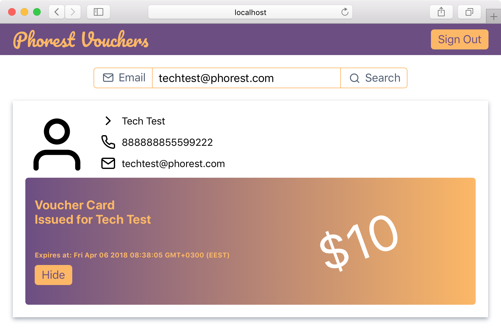

# phorest-voucher

Example app to connect Phorest API.

## Prerequisites

You will need the following things properly installed on your computer.

* [Git](https://git-scm.com/)
* [Node.js](https://nodejs.org/)
* [Yarn](https://yarnpkg.com/)
* [Ember CLI](https://ember-cli.com/)
* [Google Chrome](https://google.com/chrome/)

## Installation

* `git clone git@github.com:kolybasov/phorest-voucher.git`
* `cd phorest-voucher`
* `yarn install`

## Running / Development

* `ember serve`
* Visit your app at [http://localhost:4200](http://localhost:4200).
* Visit your tests at [http://localhost:4200/tests](http://localhost:4200/tests).

### Running Tests

* `ember test`
* `ember test --server`

### Linting

* `yarn lint:js`
* `yarn lint:js --fix`

### Building

* `ember build` (development)
* `ember build --environment production` (production)
